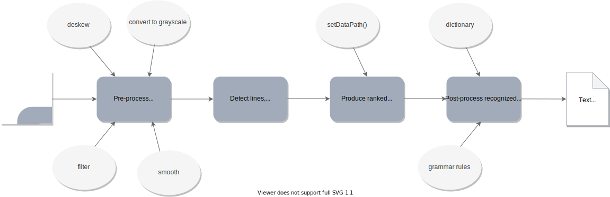
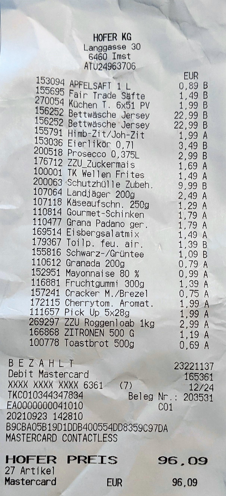
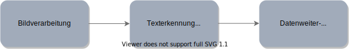

# Receipt Processor

<br/>

Die Applikation *Receipt Processor* versucht mithilfe der Verfahren der *Texterkennung (OCR)* und *Bildverarbeitung (Image Processing)*, relevante Informationen aus einem *Kassenbeleg (Kassabon)*, welcher in Form eines Bildes zur Verfügung steht, zu extrahieren und weiterzuverarbeiten. Das Bild kann dabei direkt mit der Kamera des jeweiligen Endgeräts (z.B. Smartphone) aufgenommen, oder die zu analysierende Datei aus dem Dateisystem des entsprechenden Geräts ausgewählt und hochgeladen werden. 

<br/>

<div align="center">
    
    <span>Abbildung 1: Allgemeine Aufgaben & Funktionalitäten des OCR-Prozess</span>
</div>

<br/>

Der *OCR-Prozess* setzt sich dabei aus der *Datenvorverarbeitung*, der *Texterkennung* und der *Datenweiterverarbeitung* zusammen. Bei der Datenvorverarbeitung wird das Bild beispielsweise begradigt und entzerrt (deskewed), sowie in Graustufen oder Schwarzweiß umgewandelt. Anschließend werden die einzelnen Zeilen, Wörter und Buchstaben erkannt, die mithilfe eines Trainingsdatensatzes einem entsprechendem Ranking von *Kandidatenzeichen* zugeordnet werden. Bei der Nachbearbeitung der erkannten Zeichen, werden die besten (am wahrscheinlichsten) Buchstaben, aufgrund des im vorherigen Schritt ermittelten *Konfidenzwerts*, ausgewählt und Sprachdaten, wie z.B. Wörterbücher und Grammatikregeln entsprechend berücksichtigt. In der Datenweiterverarbeitung werden die Informationen in den erforderlichen Kontext der jeweiligen Applikation gesetzt. Hierfür werden oftmals andere Verfahren des maschinellen Lernens eingesetzt, um den spezifischen Anwendungsfall abzudecken.

<br/>

### Tesseract.js

<hr/>

<br/>

Für den Prozess der Texterkennung wird die freiverfügbare (open source) JavaScript-basierte Bibliothek *Tesseract.js* verwendet, dessen Engine auf einem *neuronalen Netzwerk (LSTM)* basiert, um möglichst exakte (akkurate) Ergebnisse liefern zu können.

Die folgenden Ausschnitte veranschaulichen die Installation und grundlegende Verwendung von Tesseract. Dabei wird mithilfe von *emscripten*, C- und C++-Code zu *WebAssembly* kompiliert, wodurch Tessertact im Webbrowser ausgeführt und die OCR-Engine entsprechend clientseitig verwendet werden kann:

<br/>

```bash
npm install tesseract.js
```

<br/>

```JSX
import { createWorker } from 'tesseract.js';

const worker = createWorker({
    logger: m => console.log(m);
});

const processig = (image: string) async => {
    await worker.load();
    await worker.loadLanguage('deu');
    await worker.initialize('deu');
    const results = await worker.recognize(image);
    console.log(results);
    await worker.terminate();
};
```

<br/>

Die Auswahl der Sprache ist entscheidend für die Bestimmung der trainierten Sprachdaten, die bei der Verarbeitung verwendet werden sollen und können folglich die Genauigkeit der einzelnen Ergebnisse beeinflussen. Tesseract unterstützt dabei über hundert Sprachen, die mithilfe von sogenannten <a href="https://tesseract-ocr.github.io/tessdoc/Data-Files-in-different-versions.html">*Sprachcodes*</a> definiert werden. Diese können ebenfalls über *String-Verkettungen* miteinander verbunden werden.

<br/>

```JSX
await worker.loadLandguage('deu+eng');
await worker.initialize('deu+eng');
```

<br/>

Der Methode *recognize* wird das Bild als String-Parameter übergeben. Unterstützt werden dabei die gängigen Bildformate: jpg, png, bmp und pbm. Das Ergebnis der Analyse wird in der Variable *results* gespeichert, welche anschließend für einen ersten Überblick auf der Konsole ausgegeben wird.

Der folgende Ausschnitt zeigt die Attribute und Ausprägungen, die in dem Objekt *result* enthalten sind:

<br/>

```JSX
{
  text: "feedMe is an awesome application for managing food and nutrition."
  hocr: "<div class='ocr_page' id= ..."
  tsv: "1 1 0 0 0 0 0 0 1486 ..."
  box: null
  unlv: null
  osd: null
  confidence: 90
  blocks: [{...}]
  psm: "SINGLE_BLOCK"
  oem: "DEFAULT"
  version: "4.0.0-825-g887c"
  paragraphs: [{...}]
  lines: (5) [{...}, ...]
  words: (47) [{...}, {...}, ...]
  symbols: (240) [{...}, {...}, ...]
}

```


<br/>

### Kassenbeleg - Kassabon

<hr/>

<br/>

Der zu analysierende Gegenstand, ist ein herkömmlicher *Kassenbeleg*, welcher nach dem Einkauf (Bezahlvorgang) von Lebensmitteln entsprechend in einem Supermarkt erworben werden kann. Die folgende Abbildung veranschaulicht den möglichen Aufbau (Struktur), sowie Inhalt eines Kassenbelegs:

<br/>

<div align="center">
    <br/>
    <span>Abbildung 2: Mögliche Struktur & Aufbau eines Kassenbelegs</span>
</div>

<br/>


**Mögliche Herausfoderungen & Lösungsansätze:**

Kassenbelege sind in der Regel für den Konsumenten selbst, als Überblick und Dokumentation der gekauften Produkte und nicht primär für die Weiterverarbeitung von technischen Geräten konzipiert. Entsprechend gestaltet sich die Extrahierung relevanter Informationen als Herausforderung, wodurch folglich komlexe Verfahren der Texterkennung (OCR) und Bildverarbeitung benötigt werden. Die Genauigkeit der Ergebnisse hängt dabei von unterschiedlichen Faktoren, wie z.B. Schriftart- und -Größe, Qualität des Bildes und Kassenbelegs, etc. ab. Zudem werden viele OCR-Engines mit Datensätzen trainiert, die stark an Wörterbücher angelegt sind und entsprechend den Fokus auf zusammenhängende, vollständige und sinnergebende Sätze legen und nicht zum Erkennen von spezifischen Bezeichnungen konzipiert wurden.

<br/>

**Aufbau & Struktur:**

Die Kassenbelege können abhängig von dem jeweiligen Supermarkt unterschiedlich aufgebaut und strukturiert sein, sowie verschiedene Informationen zu den Lebensmitteln enthalten, welche entweder für die Applikation selbst irrelevant, oder nicht aussagekräftig genug sind. Folglich muss der Texterkennungsprozess unabhängig von der Struktur des Kassenbelegs funktionieren können, da beispielsweise Verfahren zum Erkennen von Layouts durch entsprechende Layout-Engines nur bedingt angewendet werden können.

<br/>

**Irrelevante Informationen & Produktbezeichnungen:**

Auf dem Kassenbeleg befinden sich zusätzliche Informationen, die für die Applikation nicht weiter relevant sind, wie z.B. Name und Adresse des Lebensmittelgeschäfts, sowie die Art der Bezahlung, Produkte die keine Lebensmittel sind, etc. Folglich entsteht ein zusätzlicher Mehraufwand bei der Weiterverarbeitung der Daten, die sich zum einen negativ auf die Effizienz auswirken kann und zum anderen eine Erhöhung der allgemeinen Komplexität mit sich bringt.

<br/>

### Informationsextraktion und -Aufbereitung (Anforderung 1)

<hr>

<br/>

Die Applikation beschäftigt sich folglich mit der Herausforderung und Anforderung der *Informationsextraktion* und *-Aufbereitung* mithilfe der Verfahren von OCR. Die folgende Abbildung veranschaulicht dabei den grundlegenden Ablauf, sowie die allgemeine Herangehensweise und abstrahiert den zuvor dargestellten OCR-Prozess (siehe Abbildung 1).

<br/>

<div align="center">
    <br/>
    <span>Abbildung 3: Abstraktion des OCR-Prozesses - allgemeine Aufgaben der Applikation</span>
</div>

<br/>

**Bildvorverarbeitung:**

Der *Bildvorverarbeitungsprozess* umfasst grundlegende Verfahren, wie z.B. *Binarization*, *Image-Resizing*, sowie das *Entfernen* von *nicht-textuellen Flächen*, etc.


<br/>

**Texterkennung (OCR):**

<br/>

**Datenweiterverarbeitung:**

<br/>

### Binarization

<hr/>

<br/>

Unter *Binarization* versteht man die Umwandlung der Pixel eines Bildes in *Schwarz* oder *Weiß*, um den Kontrast entsprechend zu erhöhen und die einzelnen Buchstaben folglich besser erkennen zu können.


<br/>

<br/>

<hr/>

<style>
    p {
        font-size: 14px;
        line-height: 1.75;
    }
    span {
        font-size: 12px;
        font-style: italic;
    }
</style>


